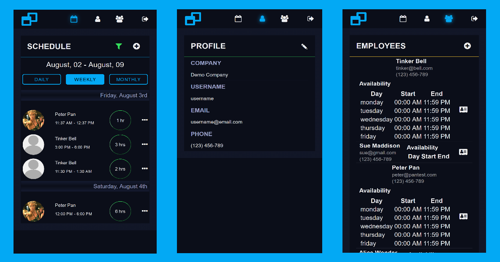

 [Frames](https://frames-app.surge.sh) - staff scheduling app
============================
Mobile-friendly, intuitive, and easy to use staff scheduling application for small businesses. 
When scheduling for multiple shifts, multiple employees over multiple divergent time zones, 
Frames steps in to take out the leg work. Users can easily add, assign, edit and delete shifts, 
maintain a list of employees and contact information and keep their schedules straight in daily, 
weekly or monthly views.

Live app can be viewed [here](https://frames-app.surge.sh).

Check out the server repo [here](https://github.com/valsakel/frames-server).

**Demo account for testing:**  
username: **username**  
password: **password**

## Screenshots


## Motivation
This project was built in 3 weeks with 3 other fellow students from the Engineering Immersion program at 
[Thinkful](https://www.thinkful.com/bootcamp/atlanta/). We practiced daily standups and SCRUM meetings with 
our Team Lead, used [Trello](https://trello.com) as a project management tool, alternated the roles to let 
everyone to contribute to both the server and the client code. But most importantly, we had a lof of fun 
building this application!

## Installation
Clone the GitHub repository and use [NPM](https://www.npmjs.com/) to install project dependencies.
```$xslt
$ git clone https://github.com/thinkful-ei20/frames-client.git
$ cd frames-client
$ npm install
```

## Tech Stack
* [create-react-app](https://github.com/facebook/create-react-app)
* [React](https://reactjs.org/)
* [Redux](https://redux.js.org/)
* [jwt-decode](https://www.npmjs.com/package/jwt-decode)
* [Jest](https://jestjs.io)
* [Enzyme](https://airbnb.io/projects/enzyme)
* [Moment.js](https://momentjs.com)
* [Surge.sh](https://surge.sh)
 
 ## Authors
* [Cameron Prier](https://github.com/Csprier)
* [Marina Dargitz](https://github.com/mdargitz)
* [Marina Valiquette](https://github.com/Sakela17)
* [Gianluca Paterson](https://github.com/patersog)


